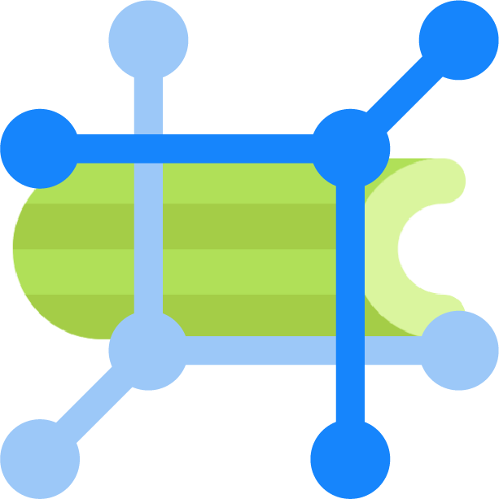

# Netbox Celery Plugin

  
   
  
  
  
  
   
  An App for <a href="https://github.com/netbox-community/netbox">Netbox</a>.

## Navigation

- [1. Installation](install.md)
- [2. Models](models.md)
